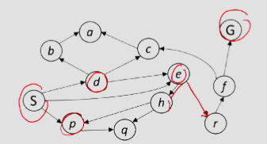

Here are your notes with the new content integrated at logical places:

# Search Problems and Methods - Week 2 Notes

## Core Concepts

### Problem Solving in AI
- **Goal**: Develop general algorithms for classes of problems (not problem-specific solutions)
- **Problem Types**: Decision, Search, Counting, Optimization
- **Key Challenge**: State spaces can be enormous (Chess: ~10^50 states)

## Agent Architecture

### Reflex vs Planning Agents
| Reflex Agents | Planning Agents |
|:--------------|:----------------|
| React to current state | Consider future consequences |
| No lookahead | Model world evolution |
| Fast but limited | Slower but more capable |
| "How world IS" | "How world WOULD BE" |

### Planning Strategies
- **Complete**: Find any valid solution (faster)
- **Optimal**: Find best solution (slower, explores more)
- **Replanning**: Adapt plan during execution when failures occur

## Search Problem Components

1. **States**: Problem configurations (abstracted from world)
2. **Initial State**: Starting configuration
3. **Actions**: Available state transitions
4. **Transition Model**: State × Action → State
5. **Goal Test**: State → Boolean
6. **Cost Function**: Path → Number (optional)

**Solution**: Action sequence from initial → goal state

## Critical Distinctions

### World State vs Search State
- **World State**: Complete environment details (intractable)
- **Search State**: Minimal info for planning (abstraction is key)

### State Space Graph vs Search Tree
| State Space Graph | Search Tree |
|:-----------------|:------------|
| Each state appears once | States can repeat |
| Represents problem structure | Represents exploration |
| Usually can't build fully | Build incrementally |
| Nodes = states | Nodes = paths to states |

## Search Complexity Fundamentals

### Notation
- **b**: Branching factor (avg number of children per node)
- **m**: Maximum depth of search tree
- **s**: Depth of shallowest solution
- **C***: Optimal solution cost
- **ε**: Minimum arc cost

### Tree Size Formula
Total nodes in tree of depth m: **1 + b + b² + ... + b^m = O(b^m)**

## Uninformed Search Algorithms

### Key Components
- **Fringe/OPEN**: Nodes to explore (priority queue), **partial plans under consideration**
- **CLOSED**: Already explored nodes (prevents cycles)
- **Expansion**: Generate children of current node
- **Strategy**: Order of node exploration

### Depth-First Search (DFS)
- **Strategy**: Expand deepest node first
- **Implementation**: LIFO stack
- **What it expands**: Leftmost prefix of tree (could process entire tree)
- **Time**: O(b^m) where b=branching, m=max depth
- **Space**: O(bm) - only siblings on path to root
- **Complete**: Only if prevent cycles (m could be infinite)
- **Optimal**: No (finds leftmost solution regardless of depth/cost)

### Breadth-First Search (BFS)
- **Strategy**: Expand shallowest node first
- **Implementation**: FIFO queue
- **What it expands**: All nodes above shallowest solution
- **Time**: O(b^s) where s=solution depth
- **Space**: O(b^s) - stores entire last tier
- **Complete**: Yes (s must be finite if solution exists)
- **Optimal**: Only if all costs = 1

### DFS vs BFS: When to Use
- **BFS beats DFS**: Shallow solutions, many deep dead ends
- **DFS beats BFS**: Deep solutions, limited memory, all solutions at similar depth

### Uniform-Cost Search (UCS)
- **Strategy**: Expand cheapest cumulative cost first
- **Implementation**: Priority queue (by path cost)
- **Time**: O(b^(C*/ε)) where C*=optimal cost, ε=min arc cost
- **Space**: O(b^(C*/ε))
- **Complete**: Yes (if costs positive)
- **Optimal**: Yes
- **Key**: Explores cost contours, not depth levels
- **Note**: BFS finds shortest path by actions, UCS finds least-cost path

### Iterative Deepening
- **Strategy**: DFS with increasing depth limits (1, 2, 3...)
- **How it works**:
  - Run DFS with depth limit 1. If no solution...
  - Run DFS with depth limit 2. If no solution...
  - Run DFS with depth limit 3, etc.
- **Benefit**: DFS space advantage + BFS time/shallow-solution advantages
- **Not wasteful**: Most work happens in deepest level searched
- **Time**: O(b^s) like BFS
- **Space**: O(bs) like DFS

## Search Algorithm Comparison

| Algorithm | Complete | Optimal | Time | Space |
|:----------|:---------|:--------|:-----|:------|
| DFS | No* | No | O(b^m) | O(bm) |
| BFS | Yes | No* | O(b^s) | O(b^s) |
| UCS | Yes | Yes | O(b^(C*/ε)) | O(b^(C*/ε)) |
| Iterative Deepening | Yes | No* | O(b^s) | O(bs) |

*DFS complete with cycle checking; BFS/ID optimal if unit costs

## Implementation Details

### General Tree Search Pseudocode
```python
function TREE-SEARCH(problem, strategy) returns a solution, or failure
    initialize the search tree using the initial state of problem
    loop do
        if there are no candidates for expansion then return failure
        choose a leaf node for expansion according to strategy
        if the node contains a goal state then return the corresponding solution (fringe)
        else expand the node and add the resulting nodes to the search tree
    end
```

### Tree Search Demonstration: Finding Path from S to G
Tracing the Search Tree Expansion. Explore paths from S to goal G.



### Step 1: Start at S
```
Tree: [S]
Paths discovered: none yet
```

### Step 2: Expand S
```
Tree:     S
       /  |  \
      d   e   p

Paths in tree:
- S→d
- S→e  
- S→p
```

### Step 3: Expand e (continuing from S→e)
```
Tree:     S
       /  |  \
      d   e   p
         / \
        r   h

Paths in tree:
- S→d
- S→e→r
- S→e→h
- S→p
```

### Step 4: Continue expanding...
Eventually we'll find paths that reach G. The tree might discover multiple paths:

```
Possible complete paths to G:
- S→e→r→f→G
- S→e→h→r→f→G  
- S→d→e→r→f→G
- S→d→c→a→e→r→f→G
(and potentially more)
```

### Key Points About Tree Search

1. **The tree tracks PATHS, not states**: Notice how state 'e' could appear multiple times in different branches (S→e vs S→d→e)

2. **Explosion of possibilities**: Even this small graph creates many possible paths. The tree can grow exponentially.

3. **Search strategy matters**: 
   - DFS would go deep first (maybe S→d→b→a→...)
   - BFS would explore all length-1 paths, then length-2, etc.
   - The strategy determines which path to G we find first

4. **Without cycle detection**: We could get stuck in loops like S→d→e→d→e→d... forever

This is why the CLOSED list (tracking visited states) is critical for efficiency!

### The One Queue Principle
All uninformed searches use same algorithm with different fringe ordering:
- DFS: Stack (LIFO)
- BFS: Queue (FIFO)
- UCS: Priority Queue (by cost)

## Key Insights

1. **Repeated States**: Critical to track (CLOSED list) to avoid exponential blowup
2. **Search operates on models**: Quality limited by model accuracy
3. **Trade-offs**: 
   - DFS: Low memory, not optimal
   - BFS: Guaranteed shortest path, high memory
   - UCS: Optimal for weighted graphs, explores all directions
   - Iterative Deepening: Memory efficient, complete

## When to Use Which

- **DFS**: Deep solutions, limited memory
- **BFS**: Shallow solutions, need shortest path by actions
- **UCS**: Varying action costs, need optimal path
- **Iterative Deepening**: Unknown depth, limited memory, want completeness


### Uniform-Cost Search (UCS)
- **Strategy**: Expand node with lowest cumulative path cost g(n)
- **Implementation**: Priority queue ordered by path cost
- **What it expands**: All nodes with cost < optimal solution cost C*
  - Processes nodes in order of increasing path cost
  - Explores cost contours like ripples: c≤1, c≤2, c≤3, etc.
  - "Effective depth" = C*/ε (not actual tree depth)
- **Time**: O(b^(C*/ε)) where:
  - C* = optimal solution cost
  - ε = minimum arc cost
  - Exponential in effective depth, not actual depth
- **Space**: O(b^(C*/ε)) - stores last cost contour
- **Complete**: Yes, if:
  - Solution has finite cost
  - Minimum arc cost is positive (ε > 0)
- **Optimal**: Yes - guaranteed to find least-cost path

### How UCS Works
```
Start with priority queue: [(start, cost=0)]
While queue not empty:
    Remove node with minimum cost
    If goal: return path
    Add to closed set
    For each neighbor:
        new_cost = current_cost + edge_cost
        If not visited: add (neighbor, new_cost) to queue
```

### UCS vs BFS
- **BFS**: Finds shortest path by number of actions
- **UCS**: Finds least-cost path when actions have different costs
- **Example**: In a map with highways (cost=1) and dirt roads (cost=5), BFS might return more dirt roads while UCS finds the cheaper highway route

### UCS Characteristics
**Advantages**:
- Complete and optimal for weighted graphs
- Handles variable action costs
- Systematic exploration guarantees finding best solution

**Disadvantages**:
- Explores in all directions (no goal awareness)
- Can expand many irrelevant nodes far from goal
- Memory intensive for large cost variations
- Solution: Use heuristics (leads to A* search)

### Implementation Details
- **Priority Queue**: Use heap for O(log n) operations
- **CLOSED Set**: Use hash set for O(1) membership checking
  - Never use actual list - causes O(n) lookups
  - Critical for preventing repeated state expansion
- **Path Tracking**: Store parent pointers to reconstruct solution

## Repeated States

### The Problem
- Failure to detect repeated states can turn a linear problem into an exponential one!
- For checking repeated states, we use a **closed list** (visited set)

### Why Repeated States Matter
Without cycle detection, search can:
- Revisit the same state multiple times through different paths
- Get stuck in infinite loops (A→B→A→B→...)
- Turn O(n) problems into O(b^n) problems

### Solution: The CLOSED List
- Track all previously visited states
- Before expanding a node, check if state already visited
- Implementation matters:
  - **Don't use actual list**: O(n) lookup time
  - **Use hash set**: O(1) average lookup time
  - **Use tree set**: O(log n) worst case if needed

### Graph Search vs Tree Search
- **Tree Search**: No repeated state detection (can revisit states)
- **Graph Search**: Uses CLOSED list to prevent revisiting states
  - More memory efficient
  - Guarantees termination in finite spaces
  - Essential for cyclic graphs