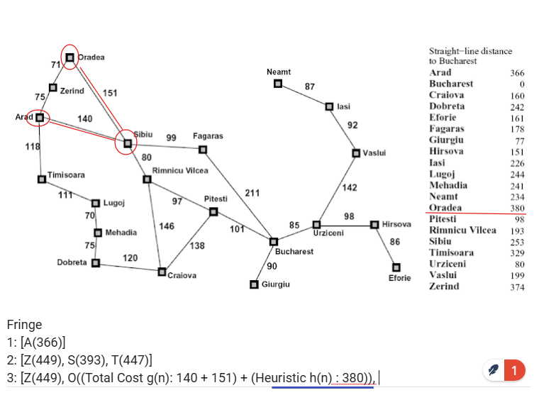
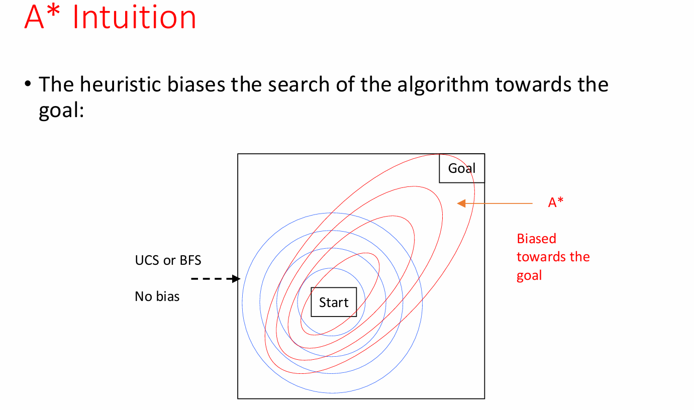

# Informed Search & A\* Algorithm

## The Big Picture

**Problem**: Finding the shortest path from start to goal in a graph (like navigating a maze or GPS routing).

**Uninformed search** (BFS, DFS, UCS) explores blindly - thorough but slow.  
**Informed search** uses domain knowledge (heuristics) to search smarter.

## Core Search Components

### Search Problem Elements

- **States**: Configurations of the world
- **Actions**: Available moves with associated costs
- **Successor Function**: How actions change states
- **Start State & Goal Test**: Where we begin and end

### Search Tree vs State Space

- **State Space**: All possible world configurations
- **Search Tree**: Plans to reach states (nodes = plans, edges = actions)
- Plans accumulate costs (sum of action costs along path)

## How Informed Search Works

**Heuristic Function h(n)**: Educated guess of distance from any node to goal

- Must be computationally efficient (otherwise just solve the problem!)
- Quality dramatically impacts performance
- Example: "as the crow flies" distance on a map

## Search Strategy Comparison

### Greedy Search

"Always move toward what looks closest"

- **Strategy**: Minimize h(n) only
- **Behavior**: Fast but reckless - can loop or miss shorter paths
- **Properties**:
  - Incomplete (can get stuck in loops)
  - Time/Space: O(b^m) where b=branching factor, m=max depth
  - Non-optimal

### Uniform Cost Search (UCS)

"Expand cheapest path so far"

- **Strategy**: Minimize g(n) only
- **Behavior**: Systematic, guaranteed optimal but slow

### A\* Search



"Balance past costs with future estimates"

- **Formula**: f(n) = g(n) + h(n)
  - **g(n)**: Actual cost from start to n (backward cost)
  - **h(n)**: Estimated cost from n to goal (forward cost)
  - **f(n)**: Total estimated path cost through n

**The Balance**:

- Only g(n) → becomes UCS (exhaustive, slow, optimal)
- Only h(n) → becomes Greedy (fast, often suboptimal)
- g(n) + h(n) → A\* achieves both speed and optimality

**Admissibility**: h(n) must always underestimate actual cost to goal (e.g., Euclidean distance as straight line from A to B will always be ≤ actual path distance)

### A\* Search Behavior Visualization



**Key Insight**: The heuristic biases search toward the goal while maintaining optimality

- **UCS/BFS**: Explores uniformly in all directions (concentric circles from start)
- **A\***: Explores elliptically, stretched toward the goal
- The better the heuristic, the more focused the search becomes

## Critical Implementation Details

### When to Terminate

**Stop when DEQUEUING goal, not when first seeing it**

- Ensures we've found the cheapest path to goal
- First path found might not be optimal

### Graph Search Enhancement

- Maintain **closed set** of already-expanded states
- Never expand same state twice (avoids redundant work)
- Store as set for O(1) lookup
- Can cause exponential speedup

## Optimality Guarantees

### Admissible Heuristic

"Never overestimate"

- **Definition**: h(n) ≤ actual cost to goal
- **Required for**: Tree search optimality
- **Example**: Straight-line distance ≤ actual driving distance
- **Goal**: Get as close as you can to the upper-bound (cost to goal) without going over

**Admissibility**: h(n) ≤ actual cost to goal. The heuristic must never overestimate - like guessing a friend lives "at most 10 miles away" when they actually live 12 miles away is admissible. Straight-line distance works because you can't drive shorter than a straight line.

### Consistent Heuristic (Stronger)

"Estimates can't jump up"

- **Definition**: h(n) ≤ cost(n→n') + h(n')
- **Required for**: Graph search optimality
- **Implication**: f-values never decrease along paths
- **Result**: More efficient than just admissible

**Consistency**: h(n) ≤ cost(n→n') + h(n'). The heuristic can't suddenly jump up as you move - if you estimate "5 miles left to goal" and walk 1 mile closer, your new estimate must be ≤ 4 miles (not suddenly "8 miles left"). This prevents the algorithm from second-guessing earlier decisions.

## Building Good Heuristics

### Relaxation Method

Solve easier version of problem:

- **Original**: Navigate city streets with traffic laws
- **Relaxed**: Pretend you can fly straight → Euclidean distance
- Relaxed solutions give admissible heuristics

### Common Examples

**8-Puzzle**:

1. **Misplaced tiles**: Count wrong positions (relaxes movement rules)
2. **Manhattan distance**: Sum of tile distances to targets (better)

**Pathfinding**:

- **Euclidean**: Straight-line distance (ignores obstacles)
- **Manhattan**: Grid distance (for grid worlds)

**Fox-Goat-Cabbage**:

- Items on wrong side × 2 - 1 (minimum trips needed)

### Dominance

If h₂(n) ≥ h₁(n) for all n (both admissible):

- h₂ dominates h₁ (always prefer h₂)
- Can combine: h(n) = max(h₁(n), h₂(n))

## A\* Algorithm

```
1. Initialize: Start.g = 0, Start.h = heuristic(Start)
2. OPEN = [Start], CLOSED = []
3. While OPEN not empty:
   - N = remove lowest f-value from OPEN
   - If goal(N): return path
   - Add N to CLOSED
   - For each child M not in CLOSED or OPEN:
     * M.g = N.g + cost(N→M)
     * M.h = heuristic(M)
     * Add M to OPEN
```

## Why A\* Works (Optimality Proof)

Given optimal goal G₁ and suboptimal G₂:

- f(G₂) = g(G₂) > g(G₁) = f(G₁) (since G₂ costs more)
- A\* expands nodes in f-value order
- Therefore G₁ exits fringe before G₂
- Guarantees optimal solution found first

## Practical Insights

**A\* Performance**:

- With perfect heuristic (h = h\*): Goes straight to goal
- With h = 0: Becomes UCS
- With bad heuristic: Can be worse than uninformed search

**Memory Issues**:

- A\* stores all generated nodes
- Can run out of memory before time

## Real-World Applications

- **Video games**: NPC pathfinding
- **GPS navigation**: Route planning
- **Robotics**: Motion planning
- **AI planning**: Action sequences
- **NLP**: Parsing, translation
- **Resource allocation**: Scheduling

## A\* Variants

- **IDA\***: Iterative deepening A\* (memory-efficient)
- **SMA\***: Simplified Memory-bounded A\*
- **D\***: Dynamic A\* (replanning in changing environments)
- **LRTA\***: Learning Real-Time A\*
- **TBA\***: Time-Bounded A\*

## Key Takeaways

1. **A\* combines the best of both worlds**: Speed of greedy, optimality of exhaustive search
2. **Heuristic quality matters**: Better heuristics → dramatic speedups
3. **Admissibility is key**: Never overestimate to guarantee optimality
4. **Graph search prevents redundancy**: Don't explore states twice
5. **Stop at the right time**: Dequeue goal, don't just find it

The core insight: A\* intelligently balances "what we've paid" with "what we expect to pay" to efficiently find optimal paths.

# Local Search Algorithms

## The Paradigm Shift

**Key Difference from Path-Based Search**:
- **Path-based search**: The journey matters (how to get from A to B)
- **Local search**: Only the destination matters (find the best configuration)

**When to Use Local Search**:
- State space = complete configurations
- Path is irrelevant
- Goal: Find configuration satisfying constraints
- Examples: N-queens, scheduling, optimization problems

**Core Approach**: Keep single current state, iteratively improve it

## Hill Climbing

### Basic Algorithm
```
1. Start at random state
2. Repeat:
   - Evaluate all neighbors
   - Move to best neighbor
3. Stop when no neighbor is better
```

**Strengths**:
- Simple to implement
- Memory efficient (only stores current state)
- Often finds good solutions quickly

**Weaknesses**:
- Gets stuck in local maxima
- Dependent on initial state
- Can't escape plateaus

### 8-Queens Example
**Heuristic**: h = number of attacking queen pairs
- Start with random configuration
- Move queens to reduce conflicts
- Often gets stuck at local minimum (h=1 instead of h=0)

### Hill Climbing Variants

**Stochastic Hill Climbing**:
- Choose randomly among uphill moves
- Avoids bias toward certain directions

**First-Choice Hill Climbing**:
- Generate successors randomly until finding improvement
- Good for states with many successors

**Random-Restart Hill Climbing**:
- Run hill climbing multiple times from random starts
- Take best solution found
- Simple way to escape local maxima

## Simulated Annealing

### Core Intuition
Inspired by metallurgy: Heat metal to unstick atoms, slowly cool to find low-energy configurations

### Algorithm Mechanics
**Temperature Parameter T**:
- High T → Accept many bad moves (exploration)
- Low T → Accept few bad moves (exploitation)
- Gradually decrease T (annealing schedule)

**Acceptance Probability**:
- Always accept improvements
- Accept worse moves with probability e^(ΔE/T)
- ΔE = quality difference, T = temperature

### Key Properties
- **Theoretical guarantee**: With slow enough cooling, finds global optimum with probability → 1
- **Practical reality**: Use faster cooling schedule, accept suboptimal solutions
- Widely used in practice (airline scheduling, VLSI design)

## Local Beam Search

### Algorithm
```
1. Start with k random states
2. Generate all successors of all k states
3. Select best k successors from combined pool
4. Repeat until goal found
```

**Key Insight**: Not just k parallel searches!
- States "communicate" through selection
- Successful states spawn more exploration nearby
- Similar to breadth-first search with limited memory

## Genetic Algorithms

### Bio-Inspired Optimization

**Representation**:
- States = strings (chromosomes)
- Population = k states
- Fitness function evaluates quality

### Genetic Operators

**Selection**:
- Probability proportional to fitness
- Example: fitness 24,23,20,11 → probabilities 31%,29%,26%,14%

**Crossover**:
- Combine two parents to create offspring
- Exchange subsequences between parents
- Exploits good partial solutions

**Mutation**:
- Random changes with low probability
- Maintains diversity
- Prevents premature convergence

### 8-Queens GA Example
- **Encoding**: Position of queen in each column
- **Fitness**: Number of non-attacking pairs (max=28)
- **Crossover**: Split parent strings, recombine
- **Mutation**: Randomly move a queen

## Continuous State Spaces

### Three Approaches

**1. Discretization**:
- Create grid with increment δ
- Apply discrete algorithms
- Trade-off: precision vs. computation

**2. Random Perturbations**:
- Generate random moves
- Apply hill climbing or simulated annealing
- Good when gradient unavailable

**3. Gradient-Based Methods**:
- Compute ∇f(x) = (∂f/∂x₁, ∂f/∂x₂, ...)
- Gradient descent: x ← x - α∇f(x)
- Finds local extrema where ∇f(x) = 0

### Gradient Descent
**Update Rule**: x ← x - α∇f(x)
- α = learning rate (step size)
- Direction: Steepest decrease
- Converges to local minimum

**Example - Facility Location**:
- Minimize total distance to customers
- f(x) = Σ√[(x-xᵢ)² + (y-yᵢ)²]
- Solve ∇f(x) = 0 for optimal location

## Comparison Summary

| Algorithm | Escapes Local Max? | Memory | Guarantees |
|:----------|:------------------|:-------|:-----------|
| Hill Climbing | No | O(1) | None |
| Random Restart | Yes (multiple runs) | O(1) | None |
| Simulated Annealing | Yes (probabilistic) | O(1) | Global opt (theory) |
| Beam Search | Partially | O(k) | None |
| Genetic Algorithm | Yes (diversity) | O(k) | None |

## Key Takeaways

1. **Local search trades completeness for efficiency** - no systematic exploration
2. **Randomization helps escape local optima** - all successful variants use it
3. **Population-based methods balance exploration/exploitation** - multiple states provide robustness
4. **Temperature/cooling schedules crucial** - controls exploration vs. exploitation trade-off
5. **Problem encoding matters** - especially for genetic algorithms

These algorithms excel at large-scale optimization where finding optimal paths is unnecessary or infeasible.