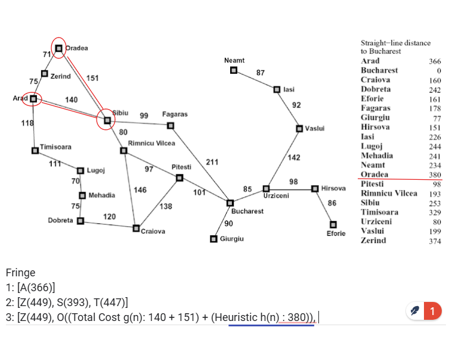
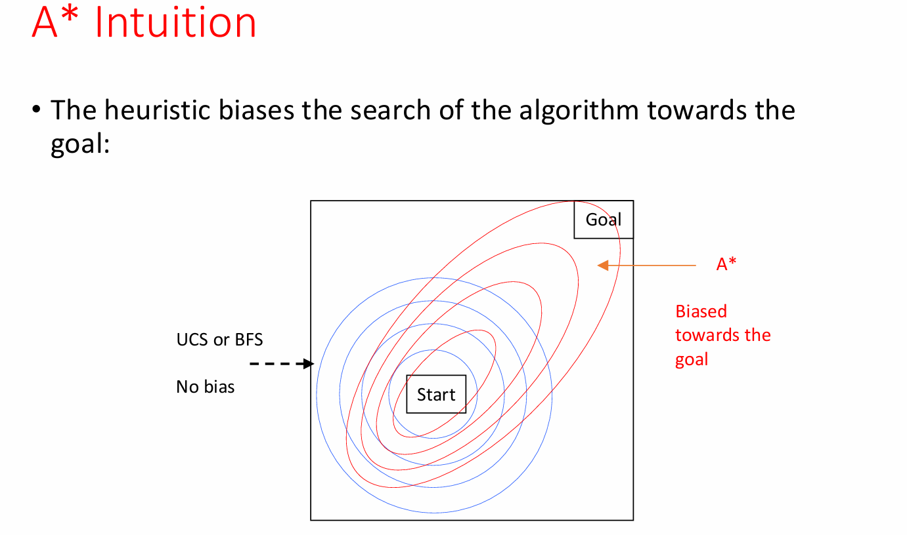

# Informed Search & A\* Algorithm

## The Big Picture

**Problem**: Finding the shortest path from start to goal in a graph (like navigating a maze or GPS routing).

**Uninformed search** (BFS, DFS, UCS) explores blindly - thorough but slow.  
**Informed search** uses domain knowledge (heuristics) to search smarter.

## Core Search Components

### Search Problem Elements

- **States**: Configurations of the world
- **Actions**: Available moves with associated costs
- **Successor Function**: How actions change states
- **Start State & Goal Test**: Where we begin and end

### Search Tree vs State Space

- **State Space**: All possible world configurations
- **Search Tree**: Plans to reach states (nodes = plans, edges = actions)
- Plans accumulate costs (sum of action costs along path)

## How Informed Search Works

**Heuristic Function h(n)**: Educated guess of distance from any node to goal

- Must be computationally efficient (otherwise just solve the problem!)
- Quality dramatically impacts performance
- Example: "as the crow flies" distance on a map

## Search Strategy Comparison

### Greedy Search

"Always move toward what looks closest"

- **Strategy**: Minimize h(n) only
- **Behavior**: Fast but reckless - can loop or miss shorter paths
- **Properties**:
  - Incomplete (can get stuck in loops)
  - Time/Space: O(b^m) where b=branching factor, m=max depth
  - Non-optimal

### Uniform Cost Search (UCS)

"Expand cheapest path so far"

- **Strategy**: Minimize g(n) only
- **Behavior**: Systematic, guaranteed optimal but slow

### A\* Search



"Balance past costs with future estimates"

- **Formula**: f(n) = g(n) + h(n)
  - **g(n)**: Actual cost from start to n (backward cost)
  - **h(n)**: Estimated cost from n to goal (forward cost)
  - **f(n)**: Total estimated path cost through n

**The Balance**:

- Only g(n) → becomes UCS (exhaustive, slow, optimal)
- Only h(n) → becomes Greedy (fast, often suboptimal)
- g(n) + h(n) → A\* achieves both speed and optimality

**Admissibility**: h(n) must always underestimate actual cost to goal (e.g., Euclidean distance as straight line from A to B will always be ≤ actual path distance)

### A\* Search Behavior Visualization



**Key Insight**: The heuristic biases search toward the goal while maintaining optimality

- **UCS/BFS**: Explores uniformly in all directions (concentric circles from start)
- **A\***: Explores elliptically, stretched toward the goal
- The better the heuristic, the more focused the search becomes

## Critical Implementation Details

### When to Terminate

**Stop when DEQUEUING goal, not when first seeing it**

- Ensures we've found the cheapest path to goal
- First path found might not be optimal

### Graph Search Enhancement

- Maintain **closed set** of already-expanded states
- Never expand same state twice (avoids redundant work)
- Store as set for O(1) lookup
- Can cause exponential speedup

## Optimality Guarantees

### Admissible Heuristic

"Never overestimate"

- **Definition**: h(n) ≤ actual cost to goal
- **Required for**: Tree search optimality
- **Example**: Straight-line distance ≤ actual driving distance
- **Goal**: Get as close as you can to the upper-bound (cost to goal) without going over

**Admissibility**: h(n) ≤ actual cost to goal. The heuristic must never overestimate - like guessing a friend lives "at most 10 miles away" when they actually live 12 miles away is admissible. Straight-line distance works because you can't drive shorter than a straight line.

### Consistent Heuristic (Stronger)

"Estimates can't jump up"

- **Definition**: h(n) ≤ cost(n→n') + h(n')
- **Required for**: Graph search optimality
- **Implication**: f-values never decrease along paths
- **Result**: More efficient than just admissible

**Consistency**: h(n) ≤ cost(n→n') + h(n'). The heuristic can't suddenly jump up as you move - if you estimate "5 miles left to goal" and walk 1 mile closer, your new estimate must be ≤ 4 miles (not suddenly "8 miles left"). This prevents the algorithm from second-guessing earlier decisions.

## Building Good Heuristics

### Relaxation Method

Solve easier version of problem:

- **Original**: Navigate city streets with traffic laws
- **Relaxed**: Pretend you can fly straight → Euclidean distance
- Relaxed solutions give admissible heuristics

### Common Examples

**8-Puzzle**:

1. **Misplaced tiles**: Count wrong positions (relaxes movement rules)
2. **Manhattan distance**: Sum of tile distances to targets (better)

**Pathfinding**:

- **Euclidean**: Straight-line distance (ignores obstacles)
- **Manhattan**: Grid distance (for grid worlds)

**Fox-Goat-Cabbage**:

- Items on wrong side × 2 - 1 (minimum trips needed)

### Dominance

If h₂(n) ≥ h₁(n) for all n (both admissible):

- h₂ dominates h₁ (always prefer h₂)
- Can combine: h(n) = max(h₁(n), h₂(n))

## A\* Algorithm

```
1. Initialize: Start.g = 0, Start.h = heuristic(Start)
2. OPEN = [Start], CLOSED = []
3. While OPEN not empty:
   - N = remove lowest f-value from OPEN
   - If goal(N): return path
   - Add N to CLOSED
   - For each child M not in CLOSED or OPEN:
     * M.g = N.g + cost(N→M)
     * M.h = heuristic(M)
     * Add M to OPEN
```

## Why A\* Works (Optimality Proof)

Given optimal goal G₁ and suboptimal G₂:

- f(G₂) = g(G₂) > g(G₁) = f(G₁) (since G₂ costs more)
- A\* expands nodes in f-value order
- Therefore G₁ exits fringe before G₂
- Guarantees optimal solution found first

## Practical Insights

**A\* Performance**:

- With perfect heuristic (h = h\*): Goes straight to goal
- With h = 0: Becomes UCS
- With bad heuristic: Can be worse than uninformed search

**Memory Issues**:

- A\* stores all generated nodes
- Can run out of memory before time

## Real-World Applications

- **Video games**: NPC pathfinding
- **GPS navigation**: Route planning
- **Robotics**: Motion planning
- **AI planning**: Action sequences
- **NLP**: Parsing, translation
- **Resource allocation**: Scheduling

## A\* Variants

- **IDA\***: Iterative deepening A\* (memory-efficient)
- **SMA\***: Simplified Memory-bounded A\*
- **D\***: Dynamic A\* (replanning in changing environments)
- **LRTA\***: Learning Real-Time A\*
- **TBA\***: Time-Bounded A\*

## Key Takeaways

1. **A\* combines the best of both worlds**: Speed of greedy, optimality of exhaustive search
2. **Heuristic quality matters**: Better heuristics → dramatic speedups
3. **Admissibility is key**: Never overestimate to guarantee optimality
4. **Graph search prevents redundancy**: Don't explore states twice
5. **Stop at the right time**: Dequeue goal, don't just find it

The core insight: A\* intelligently balances "what we've paid" with "what we expect to pay" to efficiently find optimal paths.
