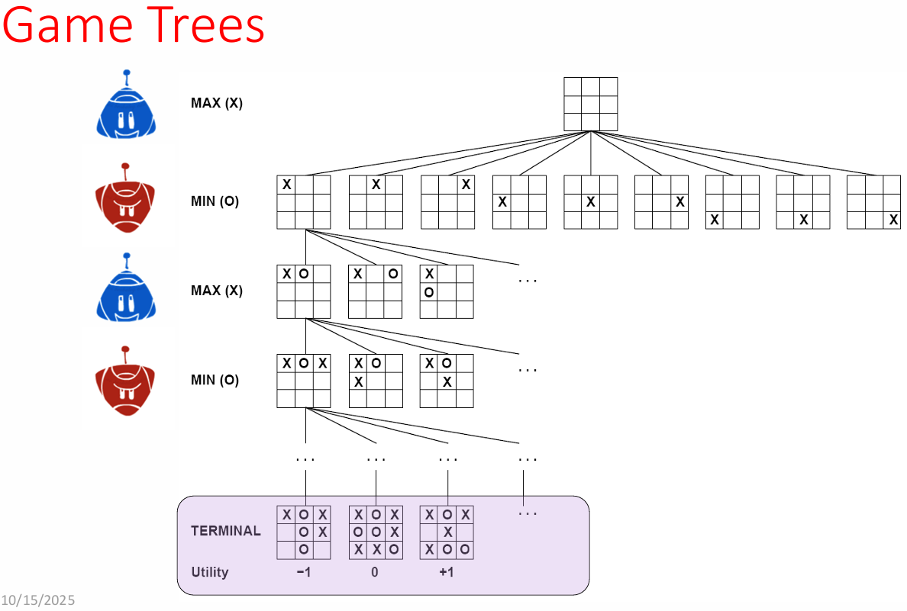
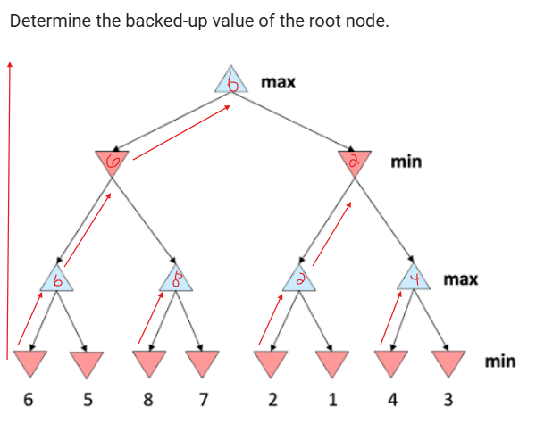
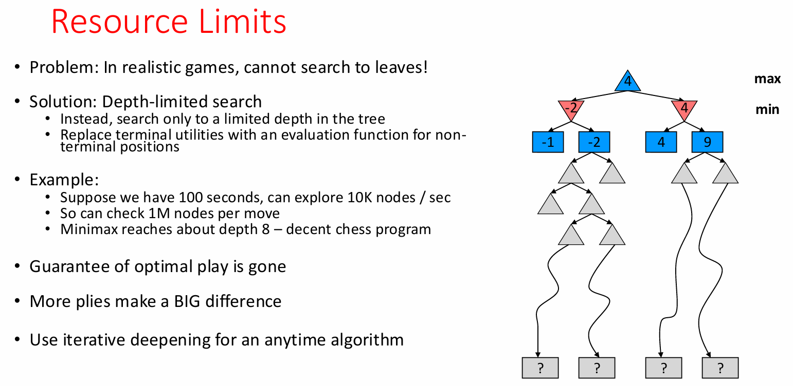

# Adversarial Search I: Game Playing

## Introduction to Game Playing

Game playing represents a specialized domain of AI where agents must reason about adversarial environments. Unlike standard search problems where we find paths to goals, game playing requires anticipating and countering opponent moves.

### Historical Milestones

- **Checkers (2007)**: Completely solved - optimal play determined for all positions
- **Chess (1997)**: Deep Blue defeats Kasparov, examining 200M positions/second
- **Go (2016)**: AlphaGo defeats human champions using Monte Carlo Tree Search and learned evaluation functions

## Game Classification Framework

### Key Dimensions

Games are characterized along multiple axes:

| Dimension          | Categories                  | Examples                               |
| :----------------- | :-------------------------- | :------------------------------------- |
| **Information**    | Perfect vs Imperfect        | Chess (perfect) vs Poker (imperfect)   |
| **Determinism**    | Deterministic vs Stochastic | Chess vs Backgammon                    |
| **Players**        | Single, Two, Multi-player   | Puzzle vs Chess vs Diplomacy           |
| **Sum Type**       | Zero-sum vs General         | Chess (zero-sum) vs Prisoner's Dilemma |
| **Turn Structure** | Turn-based vs Simultaneous  | Chess vs Rock-Paper-Scissors           |

### Standard Game Formulation

For deterministic, observable, two-player, turn-taking, zero-sum games:

```haskell
Game = {
  s₀:         Initial state
  Player(s):  Function returning whose turn it is
  Actions(s): Legal moves from state s
  Result(s,a): Transition function
  Terminal-Test(s): Is game over?
  Utility(s,p): Payoff for player p at terminal state
}
```

The cost of `Utility` is what's considered compared to a traditional path cost as found in searches.

## Core Concepts

### Zero-Sum Games

In zero-sum games, one player's gain equals the opponent's loss:

- **Total utility always sums to zero**
- **Pure adversarial competition**
- **Allows single value representation**: MAX player maximizes, MIN player minimizes

### Game Trees vs Search Trees

#### Single-Agent Search Trees

- No adversary present
- Solution is a path from start to goal (heuristic)
- Evaluation estimates cost to reach goal
- Example: Path planning

#### Adversarial Game Trees

- Opponent actively works against you
- Solution is a strategy (complete policy)
- Evaluation measures game position's "goodness"
- Example: Chess positions

## Minimax Algorithm



### Fundamental Principle

> **Assumption**: Opponent plays optimally
> **Strategy**: Minimize the maximum possible loss

### Value Computation

The minimax value of a state represents the best achievable outcome against optimal play:

```haskell
value(state) =
  if Terminal(state):     Utility(state)
  if MAX's turn:          max(value(child) for child in successors)
  if MIN's turn:          min(value(child) for child in successors)
```

### Implementation

```python
def minimax_value(state):
    if is_terminal(state):
        return utility(state)

    if is_max_player(state):
        return max_value(state)
    else:
        return min_value(state)

def max_value(state):
    v = -infinity
    for action in actions(state):
        successor = result(state, action)
        v = max(v, minimax_value(successor))
    return v

def min_value(state):
    v = +infinity
    for action in actions(state):
        successor = result(state, action)
        v = min(v, minimax_value(successor))
    return v
```

### Minimax Properties

| Property             | Value  | Explanation                         |
| :------------------- | :----- | :---------------------------------- |
| **Complete**         | Yes    | If tree is finite                   |
| **Optimal**          | Yes\*  | Against optimal opponent only       |
| **Time Complexity**  | O(b^m) | b = branching factor, m = max depth |
| **Space Complexity** | O(bm)  | Depth-first exploration             |

\*Note: Minimax is optimal against perfect play but may not be optimal against suboptimal opponents.

### Working Through Minimax



Consider this game tree evaluation:

```
        MAX
       /   \
     MIN   MIN
    /  \   /  \
   3    2 4    5
```

1. **Terminal nodes**: Have game-defined utilities
2. **MIN nodes**: Back up minimum of children
3. **MAX nodes**: Back up maximum of children
4. **Root decision**: Choose action leading to maximum value

## Resource Limitations



### The Complexity Problem

Real games have enormous search spaces:

- Chess: b ≈ 35, m ≈ 100
- Complete search requires ~35^100 nodes (impossible)

### Depth-Limited Search Solution

When we can't search to terminal states:

1. **Set depth limit**: Based on available time
2. **Evaluation function**: Estimates position value at cutoff
3. **Trade-offs**:
   - Deeper search → Better play
   - Limited time → Must cutoff somewhere
   - No guarantee of optimal play

#### Practical Example

```haskell
Given: 100 seconds, 10K nodes/second
Total nodes: 1M nodes per move
Minimax depth: ~8 levels (decent chess)
```

### Iterative Deepening

Provides anytime behavior:

- Start with depth 1
- Increase depth until time expires
- Always have a move ready
- Later iterations reuse previous work

## Key Takeaways

1. **Game playing requires adversarial reasoning** - fundamentally different from single-agent search
2. **Minimax provides optimal play** against perfect opponents in zero-sum games
3. **Game trees grow exponentially** - complete search is infeasible for complex games
4. **Depth-limited search with evaluation functions** makes game playing practical
5. **Perfect play assumption** may not be optimal against imperfect opponents

Next lecture will cover optimizations like alpha-beta pruning to search deeper within time constraints.
