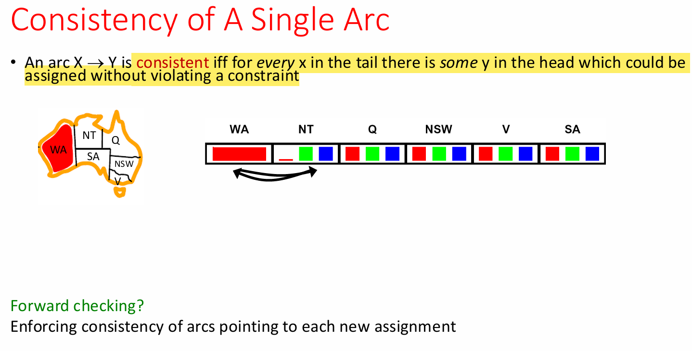

# Constraint Reasoning II

## Backtracking Search Improvements

Three general-purpose approaches provide significant speedups:
- **Filtering**: Detect inevitable failures early
- **Ordering**: Choose optimal variable and value assignment sequences
- **Structure**: Exploit constraint graph topology

## Filtering Techniques

### Forward Checking

Maintains domain information for unassigned variables by eliminating values that violate constraints when added to existing assignments. When a variable is assigned, cross off conflicting values in neighboring variables' domains.

**Limitation**: Only propagates information from assigned to unassigned variables. Cannot detect conflicts between unassigned variables (e.g., if NT and SA both have only blue remaining, forward checking won't detect this mutual exclusion).

### Constraint Propagation

Reasons from constraint to constraint rather than just from assignments to constraints, enabling earlier failure detection.

### Arc Consistency

**Definition**: Arc X → Y is consistent when every value x in the tail has at least one compatible value y in the head satisfying all constraints.




**Enforcement**: Delete values from the tail until consistency achieved. When X loses a value, all neighbors of X must be rechecked.

**Forward checking relationship**: Forward checking enforces consistency only for arcs pointing to newly assigned variables.

**Performance**:
- Runtime: O(n²d³), reducible to O(n²d²)
- Runs as preprocessor or after each assignment
- Detects failures earlier than forward checking

**Tradeoff**: More computation per step but fewer total steps.

**Outcomes after enforcement**:
- One solution remaining
- Multiple solutions remaining
- No solutions (without detecting it)

**Limitation**: Still requires backtracking search. Detecting all future problems is NP-hard.

### K-Consistency Hierarchy

Increasing degrees of consistency with corresponding computational costs:

| Level | Name | Definition |
|:------|:-----|:-----------|
| k=1 | Node Consistency | Each variable's domain contains values satisfying unary constraints |
| k=2 | Arc Consistency | Any consistent assignment to one variable extends to its neighbor |
| k=3 | Path Consistency | Provides middle ground between arc and n-consistency |
| k=n | N-Consistency | Any consistent assignment to k-1 variables extends to kth variable |

**Strong k-consistency**: Satisfies all consistency levels from 1 through k.

**Critical theorem**: Strong n-consistency enables backtrack-free solving through sequential variable selection where each assignment is guaranteed consistent with all previous assignments by appropriate k-consistency level.

**Rationale**: 
- Choose any variable (valid by 1-consistency)
- Choose second variable (2-consistency guarantees compatible value)
- Choose third variable (3-consistency guarantees compatibility with first two)
- Continue through all n variables

## Ordering Heuristics

### Variable Ordering: Minimum Remaining Values (MRV)

Select variable with fewest legal values remaining in domain. Also called "most constrained variable" or "fail-fast" ordering.

**Rationale**: Choosing min (not max) detects failures earliest, pruning search tree sooner. Variables with few options are most likely to cause backtracking, so addressing them first minimizes wasted computation.

### Tiebreaker: Degree Heuristic

Among variables with equal MRV, choose the variable with most constraints on remaining unassigned variables.

**Rationale**: Higher-degree variables have greater impact on remaining domains, so assigning them earlier provides more constraint propagation opportunities.

### Value Ordering: Least Constraining Value

For chosen variable, select value ruling out fewest options in remaining variables' domains.

**Computation**: May require rerunning filtering to determine impact of each value choice.

**Rationale**: Least (not most) constraining preserves maximum flexibility for future assignments. Since we need to find one solution, keeping options open increases success probability.

**Example**: In map coloring, if SA allows 1 value or 0 values for remaining neighbors, choose the assignment allowing 1 value.

**Combined impact**: These ordering heuristics together make 1000-queens problems feasible.

## Exploiting Problem Structure

### Independent Subproblems

Constraint graphs with disconnected components decompose into independent subproblems identifiable as connected components.

**Performance analysis** for n variables divided into subproblems of size c:
- Worst-case: O((n/c)(d^c)), linear in n
- Dramatic speedup from exponential to linear complexity

**Concrete example** (n=80, d=2, c=20):
- Without decomposition: 2^80 = 4 billion years at 10M nodes/sec
- With decomposition: 4(2^20) = 0.4 seconds at 10M nodes/sec

### Tree-Structured CSPs

**Theorem**: Acyclic constraint graphs solve in O(nd²) time versus O(d^n) for general CSPs.

**Algorithm**:
1. **Order**: Choose root variable, order variables parent-before-children (runtime: O(nd²))
2. **Remove backward**: For i=n down to 2, apply RemoveInconsistent(Parent(Xi), Xi)
3. **Assign forward**: For i=1 to n, assign Xi consistently with Parent(Xi)

**Correctness proofs**:

**Claim 1**: After backward pass, all root-to-leaf arcs are consistent.

**Proof**: Each X→Y became consistent during backward pass. Y's domain cannot reduce afterward because Y's children were processed before Y, so no future operations affect Y's domain.

**Claim 2**: If root-to-leaf arcs are consistent, forward assignment never backtracks.

**Proof**: By induction on variable position. Each variable has at least one value compatible with its parent due to maintained arc consistency.

**Why cycles break this**: Backward propagation in cyclic graphs cannot guarantee one-directional consistency because changes can propagate around cycles indefinitely.

**Note**: This principle reappears in Bayes' nets for probabilistic reasoning, demonstrating the relationship between syntactic structure and computational complexity.

### Nearly Tree-Structured CSPs

**Conditioning**: Instantiate a variable and prune its neighbors' domains.

**Cutset conditioning**: Instantiate a set of variables (cutset) such that removing them leaves a tree-structured constraint graph.

**Algorithm**:
1. Choose cutset
2. Instantiate cutset in all possible ways
3. Compute residual CSP for each instantiation
4. Solve each residual tree-structured CSP

**Performance**: Cutset size c gives runtime O(d^c · (n-c)d²), very fast for small c.

**Tradeoff**: Small cutsets provide near-tree efficiency while handling limited cycles.

### Tree Decomposition

Creates tree-structured graph of mega-variables where each mega-variable encodes part of the original CSP.

**Structure**: Subproblems overlap on shared variables to ensure consistent solutions across mega-variables.

**Consistency requirement**: Adjacent mega-variables must agree on shared variable assignments.

**Example**: 
- M1 = {WA, SA, NT} contains {(WA=r, SA=g, NT=b), (WA=b, SA=r, NT=g), ...}
- M2 = {NT, SA, Q} contains {(NT=r, SA=g, Q=b), (NT=b, SA=g, Q=r), ...}
- Agreement: M1 and M2 must have compatible (NT, SA) values

This transforms complex graphs into tractable tree structures while preserving solution validity.

## Local Search for CSPs

### Min-Conflicts Algorithm

Operates on complete states (all variables assigned) rather than partial assignments used in backtracking.

**Approach**:
- Start with complete assignment (possibly violating constraints)
- Operators reassign variable values
- No fringe maintained

**Algorithm**:
```haskell
While not solved:
  Variable selection: randomly select any conflicted variable
  Value selection: choose value violating fewest constraints
```

Uses hill climbing with h(n) = total violated constraints.

### Performance Analysis

**4-Queens example**:
- State space: 4^4 = 256 states (4 queens in 4 columns)
- Operators: Move queen within column
- Goal test: No attacks
- Evaluation: c(n) = number of attacks

**Scalability**: Given random initial state, solves n-queens in nearly constant time for arbitrary n with high probability, including n=10,000,000.

**Generalization**: Same performance characteristics hold for randomly-generated CSPs except in narrow ranges of constraint density ratios.

**Advantage over backtracking**: Linear scaling enables problems orders of magnitude larger than feasible with systematic search.

## Summary

CSPs are specialized search problems where:
- States represent partial assignments
- Goal tests check constraint satisfaction
- Basic solution uses backtracking search

**Speedup techniques**:
- **Filtering**: Forward checking and arc consistency
- **Ordering**: MRV, degree heuristic, least constraining value
- **Structure**: Tree decomposition, cutset conditioning, independent subproblems
- **Local search**: Min-conflicts for large-scale problems

**Performance progression**:
- Basic backtracking: n ≤ 25 queens
- Optimized backtracking: n = 1000 queens  
- Local search: n = 10,000,000 queens