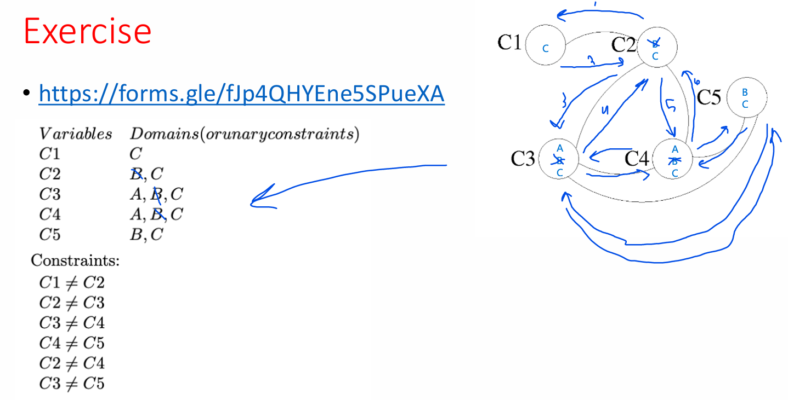

Initial Setup (after unary constraints)
After applying unary constraints (professor availability):

C1: {C}
C2: {B, C}
C3: {A, B, C}
C4: {A, B, C}
C5: {B, C}

Enforcing Arc Consistency
I'll systematically check each arc and remove inconsistent values from the tail.
Round 1: Initial arc processing
C1 → C2:

C1 only has {C}. Does C in C1 have a compatible value in C2? Yes, C2 has C. ✓

C2 → C1:

For B in C2: C1 has C (different professor). ✓
For C in C2: C1 has C (same professor, time conflict 8:30-9:30 overlaps 8:00-9:00). ✗
Remove C from C2
C2: {B}

C2 → C3:

C2 only has {B}. Does B have compatible value in C3? C3 has {A, B, C}. Time conflict: 8:30-9:30 overlaps 9:00-10:00, so B in C2 conflicts with B in C3. But A and C are available. ✓

C3 → C2:

For A in C3: C2 has B. ✓
For B in C3: C2 has B (same professor, time conflict). ✗
For C in C3: C2 has B. ✓
Remove B from C3
C3: {A, C}

C2 → C4:

C2 has {B}. C4 has {A, B, C}. Same reasoning as C2→C3.

C4 → C2:

For A in C4: C2 has B. ✓
For B in C4: C2 has B (same professor, time conflict). ✗
For C in C4: C2 has B. ✓
Remove B from C4
C4: {A, C}

C3 → C4:

For A in C3: C4 needs different professor or no time conflict. C3 is 9:00-10:00, C4 is 9:00-10:00 (same time). So A conflicts with A. C4 has C available. ✓
For C in C3: C4 has A available. ✓

C4 → C3:

For A in C4: C3 has C available. ✓
For C in C4: C3 has A available. ✓

C4 → C5:

For A in C4: C5 has {B, C}. Time 9:00-10:00 vs 9:30-10:30 overlap, so need different professor. B and C are different. ✓
For C in C4: C5 has B available. ✓

C5 → C4:

For B in C5: C4 has {A, C}. ✓
For C in C5: C4 has A available. ✓

C2 → C5:

C2 has {B}. C5 has {B, C}. Time 8:30-9:30 vs 9:30-10:30 overlap at 9:30, so need different professor. C is available. ✓

C5 → C2:

For B in C5: C2 has B (same professor, time conflict). ✗
For C in C5: C2 has B. ✓
Remove B from C5
C5: {C}

Round 2: Recheck neighbors of changed variables
Since C5 changed, recheck C4 → C5:

For A in C4: C5 has {C}. ✓
For C in C4: C5 has C (same professor, time conflict 9:00-10:00 overlaps 9:30-10:30). ✗
Remove C from C4
C4: {A}

Since C4 changed, recheck C3 → C4:

For A in C3: C4 has A (same professor, same time). ✗
For C in C3: C4 has A. ✓
Remove A from C3
C3: {C}

Final Domains After Arc Consistency

C1: {C}
C2: {B}
C3: {C}
C4: {A}
C5: {C}

One Solution to the CSP

Class 1 (8:00-9:00am): Professor C
Class 2 (8:30-9:30am): Professor B
Class 3 (9:00-10:00am): Professor C
Class 4 (9:00-10:00am): Professor A
Class 5 (9:30-10:30am): Professor C
