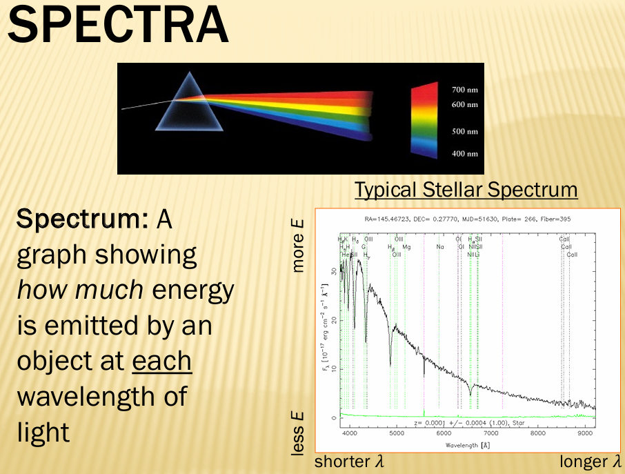

# Light and Spectra

Light is both a wave and a particle (photon)

## Spectra

**Spectrum**: A graph showing how much energy is emitted by an object at each wavelength of light

- **Prism** or **diffraction grating** can separate light into component wavelengths

## Blackbody Spectrum

**Thermal Blackbody**: An idealized object that absorbs and re-emits all electromagnetic radiation that hits it
- Emitted radiation depends only on the blackbody's temperature
- Example: Rod going from red → orange → white as temperature increases
- Allows determination of temperature of distant objects

## Blackbody Spectra

All matter above 0 K emits electromagnetic radiation

The distribution of emitted radiation (spectrum shape) depends **only** on temperature:
- Blackbody curve increases for hotter objects
- Peaks of different temperature stars fall in different parts of electromagnetic spectrum
- Hotter stars emit more frequencies of light

## Blackbody Curves

As temperature increases:
- More frequencies of light are emitted
- More energy is emitted (curve's peak increases)
- Peak wavelength shifts to shorter wavelengths (bluer)