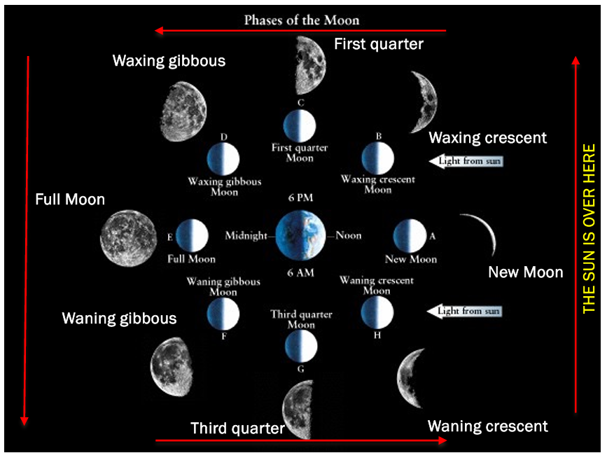
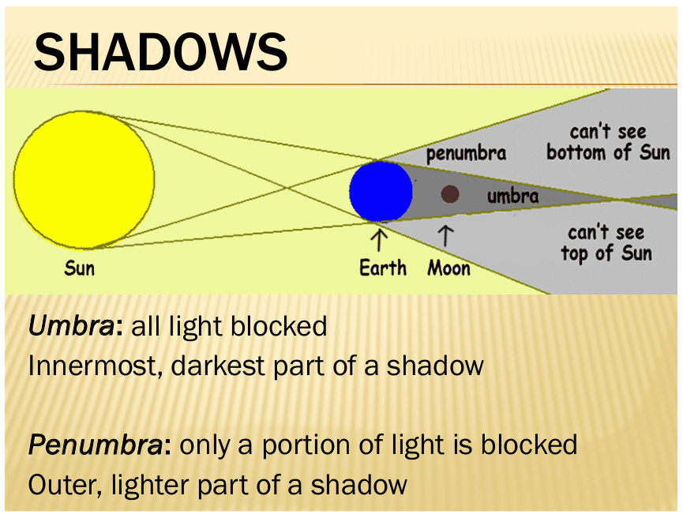
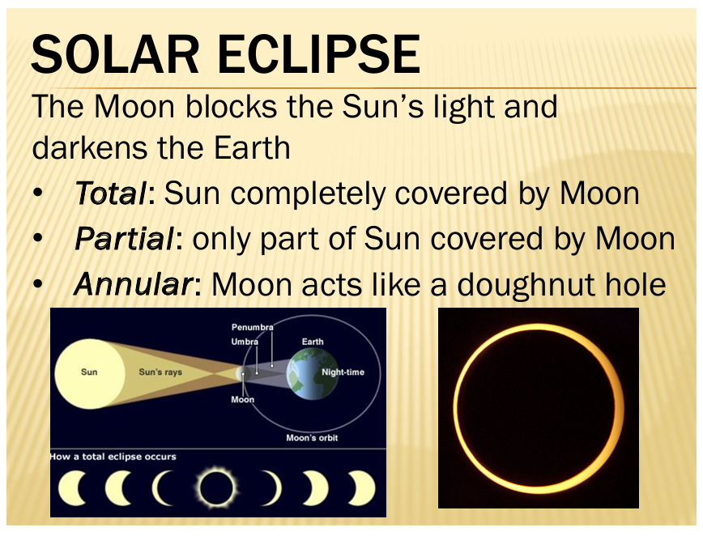
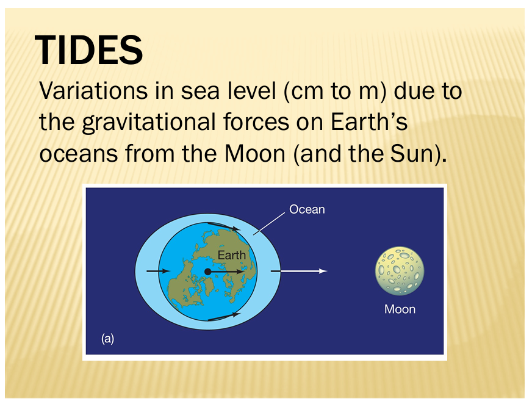

# Moon Phases, Eclipses, and Tides

## Moon Phases

**Phase**: The shape of the illuminated part of the Moon as seen from Earth

- The Sun always illuminates half of the Moon
- Earth rotates counterclockwise in phase diagrams

### Phase Cycle Table



| Phase           | Fraction Illuminated | Side Illuminated | Rises    | Sets     |
| :-------------- | :------------------- | :--------------- | :------- | :------- |
| New Moon        | 0                    | None             | 6am      | 6pm      |
| Waxing Crescent | ¼                    | West (Right)     | 9am      | 9pm      |
| First Quarter   | ½                    | West (Right)     | Noon     | Midnight |
| Waxing Gibbous  | ¾                    | West (Right)     | 3pm      | 3am      |
| Full Moon       | 1                    | All              | 6pm      | 6am      |
| Waning Gibbous  | ¾                    | East (Left)      | 9pm      | 9am      |
| Third Quarter   | ½                    | East (Left)      | Midnight | Noon     |
| Waning Crescent | ¼                    | East (Left)      | 3am      | 3pm      |

## Shadows



### Shadow Types

**Umbra**: All light blocked

- Innermost, darkest part of shadow
- Complete shadow

**Penumbra**: Only portion of light blocked

- Outer, lighter part of shadow
- Partial shadow

## Eclipses

### Lunar Eclipse

Earth blocks Sun's light and darkens Moon

**Types**:

- **Total**: Entire Moon in umbra
- **Partial**: Only part of Moon in umbra
- **Penumbral**: Moon only in penumbra

**Duration**: Maximum 1 hour 47 minutes

### Solar Eclipse

Moon blocks Sun's light and darkens Earth



**Types**:

- **Total**: Sun completely covered by Moon
  - More likely when Moon is close to Earth
- **Partial**: Only part of Sun covered by Moon
- **Annular**: Moon appears smaller than Sun, creating ring effect
  - More likely when Moon is further away from Earth

**Duration**: Maximum 7½ minutes

### Eclipse Frequency

**Why not monthly**: Earth's and Moon's orbits not in same plane

- When Moon crosses ecliptic plane → eclipses possible
  - New Moon → Solar eclipse
  - Full Moon → Lunar eclipse
- When Moon off ecliptic plane → no eclipses

**Annual occurrence**:

- Solar: 2-5 per year
- Lunar: 2-5 per year
- Combined maximum: 7 per year

## Tides

Variations in sea level (cm to m) from gravitational forces of Moon and Sun on Earth's oceans

### Gravitational Force

```
F = G(m₁m₂)/r²
G = 6.673×10⁻¹¹ N•m²/kg²
```

- Larger masses → stronger attraction
- Greater separation → weaker attraction

### Tidal Bulges



**Two bulges form**:

1. **Near-side bulge**: Points toward Moon
   - Stronger gravitational pull on water facing Moon
2. **Far-side bulge**: Points away from Moon
   - Water experiences weaker pull than Earth's center
   - Results in bulge on opposite side

**Result**: Two high tides and two low tides per day as Earth rotates through both bulges

### Tide Types

**Spring Tide**: Sun and Moon tides combine

- Greatest tidal difference
- Occurs at new and full moon
   - (alignment with sun matters more than close or far side from sun)

**Neap Tide**: Sun and Moon tides oppose

- Smallest tidal difference
- Occurs at first and third quarter
