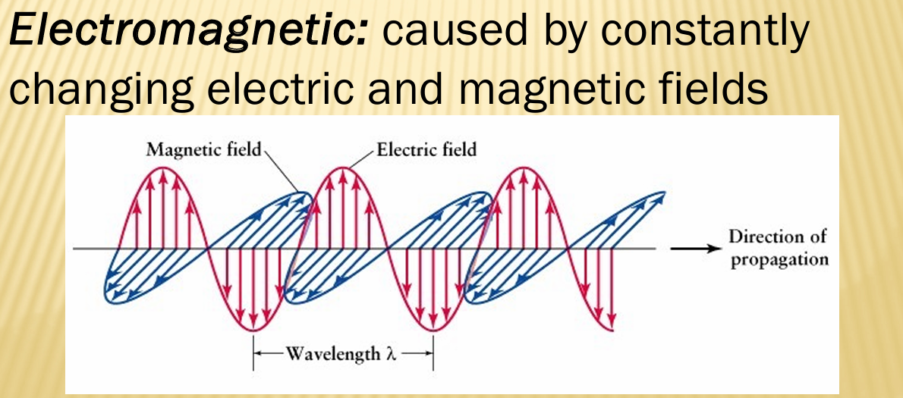
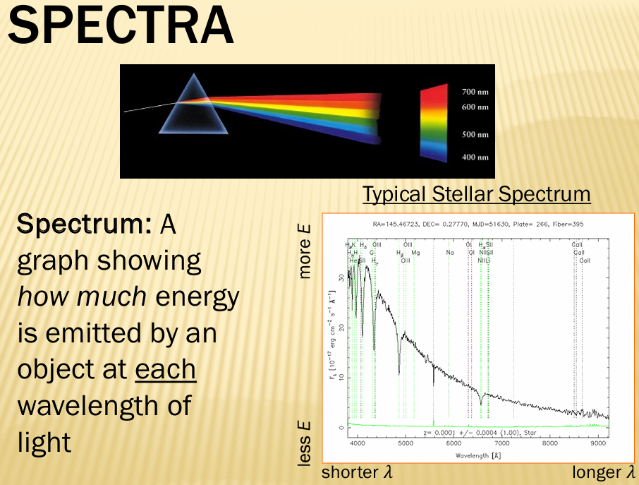
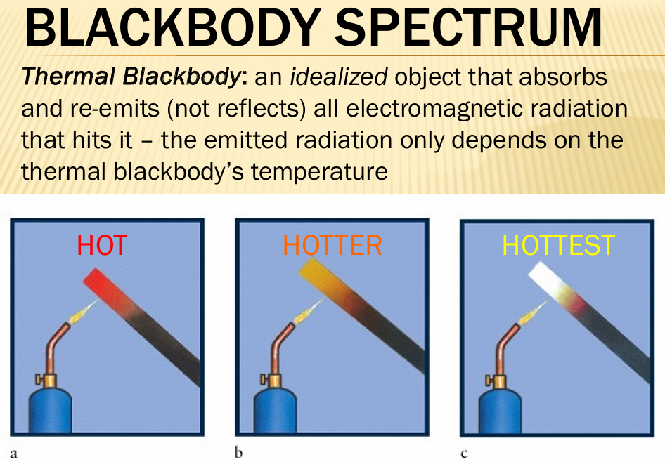

# Electromagnetic Radiation (a.k.a. Light)
Light is both a wave and a particle (photon)

### Radiation
Energy that can be transmitted through empty space.

### Electromagnetic
Caused by constantly changing electric and magnetic fields.

---

## Electromagnetic Waves

- A **wave** is a periodic disturbance in space and time that transports energy from one place to another.  
- **Electromagnetic waves** (a.k.a. light) are special because they can transport energy through a vacuum.

---

### Wave Properties

- **Period (T):** The time it takes for the wave to repeat itself (seconds, *s*).  
- **Wavelength (λ):** The distance over which the wave repeats itself (meters, *m*).  
- **Frequency (f):** The number of wave cycles that pass a given location per second (1/s = Hz).

---

### Basic Wave Diagram

```
Amplitude
   |
   |         .                 .                 .
   |        / \               / \               / \
   |       /   \             /   \             /   \
   |______/_ _ _\___________/_ _ _\___________/_ _ _\____  →  Distance
          <---- λ ---->     <---- λ ---->

          λ (lambda) = Wavelength
          T (period) = Time for one full cycle
```

---

# Electromagnetic Spectrum



- **Wavelength (λ)** and **frequency (f)** are inversely proportional:  
  \( c = \lambda f \)

- **Speed of light (c):** \( 3.00 \times 10^8 \, \text{m/s} \)

- **Planck’s constant (h):** \( 6.63 \times 10^{-34} \, \text{J·s} \)

---

## Radio Waves (AM/FM/Microwaves/+)
**Emitters:** Radio transmitters, stars, interstellar gas.  
**Uses:** Communication (radio, TV, cell phones).  
**Notes:** Longest wavelength, lowest frequency, lowest energy.

### Microwaves
**Emitters:** Radar, microwave ovens, certain astronomical objects.  
**Uses:** Cooking, radar, satellite communication.  
**Notes:** Shorter wavelength and higher energy than radio waves.

---

## Infrared (IR)
**Emitters:** Heat sources, interstellar dust.  
**Uses:** Remote controls, thermal imaging, astronomy.  
**Notes:** Associated with heat; mostly invisible to the human eye.

---

## Optical / Visible Light
**Emitters:** The Sun, light bulbs, hot objects.  
**Notes:** The only part of the electromagnetic spectrum that humans can naturally see.  
**Range:** Approximately 400–700 nm (violet to red).

---

## Ultraviolet (UV)
**Emitters:** The Sun, tanning beds, hot stars.  
**Uses:** Sterilization, black lights, medical imaging.  
**Notes:** Can damage living tissue (causes sunburns).

---

## X-rays
**Emitters:** X-ray machines, supernova remnants, black holes.  
**Uses:** Medical imaging, security scanning.  
**Notes:** Penetrates soft tissue but absorbed by dense materials like bone.

---

## Gamma Rays
**Emitters:** Radioactive decay, nuclear explosions, neutron stars, supernovae.  
**Uses:** Cancer treatment, sterilization, astrophysics.  
**Notes:** Highest frequency, shortest wavelength, and highest energy.

---

# Spectra



**Spectrum:** A graph showing how much energy is emitted by an object at each wavelength of light.

- A **prism** or **diffraction grating** can be used to separate light into its component wavelengths.

## Blackbody Spectrum



**Thermal Blackbody**: an idealized object that absorbs and re-emits (not reflects) all electromagnetic radiation that hits it - the emitted radiation only depends on the thermal blackbody's temperature

e.g. a rod going from red to orange to white depending on how hot you heat it up
this allows up to determine the temperature of far away objects

## Blackbody Spectra
All matter above 0 K emits electromagnetic radiation.

The distribution of this emitted radiation (i.e. shape of the spectrum) **ONLY** depends on the temperature of the blackbody.
- Blackbody curve increases for hotter objects.
- Note how peaks of diffrent temperature stars fall in diffrent parts of electromagnetic spectrum.
   - Hotter stars give off more differnt types of light