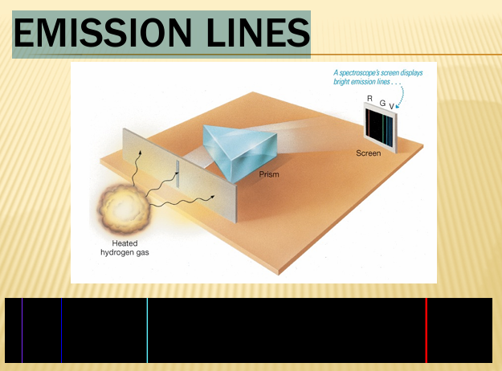
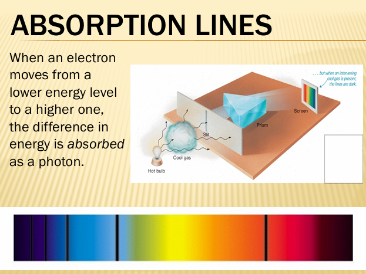
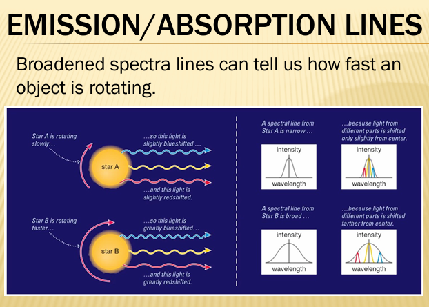

# Spectroscopy and Telescopes

## Thermal Radiation

**Thermal Radiation**: Electromagnetic radiation emitted by all objects with temperature above absolute zero

- Practical applications include LED bulb ratings (color temperature ratings like 2700K "warm" vs 5000K "daylight")

## Spectroscopy

**Spectroscopy**: The study of spectra produced when matter interacts with electromagnetic radiation

- Astronomical objects emit many wavelengths of light simultaneously
- **Dispersion**: The separation of light into component wavelengths
  - Achieved through prisms or diffraction gratings
  - Different wavelengths bend at different angles when passing through a medium
- Creates a **spectrum** showing intensity at each wavelength

## Atomic Structure

**Energy Levels**: Specific distances at which electrons can orbit a nucleus

- Electrons cannot exist between these allowed energy levels
- Each element has a unique set of energy levels
- Creates element-specific "fingerprint" in spectra
- Energy levels numbered from n=1 (closest to nucleus) outward

## Electron Transitions

**Electron Transition**: Movement of an electron between energy levels

- Energy difference between levels corresponds to specific wavelength of light
- E = hc/λ where h is Planck's constant, c is speed of light, λ is wavelength

### Emission Lines

- Electron drops from higher to lower energy level
- Energy released as a photon
- Creates bright lines on dark background (emission spectrum)
- Energy of photon = E_initial - E_final

### Absorption Lines

- Electron jumps from lower to higher energy level
- Requires absorbing photon with exact energy difference
- Creates dark lines on continuous spectrum background
- Photon energy must exactly match energy gap

### Culmination Emission/Absorption

- Spectra broadening

### Hydrogen Transitions

- Different transitions produce different wavelengths
- **Lyman series**: Transitions to n=1 (ultraviolet)
- **Balmer series**: Transitions to n=2 (visible light)
- **Paschen series**: Transitions to n=3 (infrared)

## Chemical Fingerprinting

**Spectral Lines as Identification**:

- Each element has unique energy level spacing
- Produces unique pattern of emission/absorption lines
- Acts as "chemical fingerprint" for element identification
- Sun's spectrum shows absorption lines from elements in solar atmosphere
  - Continuous spectrum from hot interior
  - Absorption lines from cooler outer layers

## Doppler Effect

**Doppler Shift**: Change in observed wavelength/frequency due to relative motion between source and observer

### Redshift (Moving Away)

- Lower observed frequency
- Longer observed wavelength
- Spectral lines shift toward red end of spectrum
- λ_observed = λ_rest × (1 + v/c) for v << c

### Blueshift (Moving Toward)

- Higher observed frequency
- Shorter observed wavelength
- Spectral lines shift toward blue end of spectrum
- λ_observed = λ_rest × (1 - v/c) for v << c

### Velocity Information

- Faster motion produces larger wavelength shifts
- Δλ/λ = v/c (for non-relativistic speeds)
- **Line Broadening**: Indicates rotation
  - One edge approaching (blueshifted)
  - Other edge receding (redshifted)
  - Width of broadening indicates rotation speed

## What Light Reveals

Light analysis provides four key measurements:

1. **Temperature**: From thermal/blackbody spectrum shape and peak wavelength
2. **Chemical Composition**: From specific absorption/emission lines
3. **Radial Velocity**: From Doppler shifts of spectral lines
4. **Rotation Rate**: From broadening of spectral lines

## Telescopes

**Telescope**: Instrument that collects, focuses, and magnifies electromagnetic radiation

### Light Gathering Power

- Proportional to collecting area: A = πr²
- Power ∝ D² (diameter squared)
- Doubling diameter = 4× light gathering power
- More light allows detection of fainter (typically more distant) objects
- Primary reason astronomers want larger telescopes

## Resolution

**Angular Resolution**: Ability to distinguish two adjacent objects in the sky

- Measured in angular separation (arcseconds)
- Depends on both object separation AND distance from observer
- Larger telescope = more light = more information = better detail

### Diffraction Limit

**Theoretical best resolution** limited by wave nature of light:

θ = 1.22 × λ/D

Where:

- θ = angular resolution (radians)
- λ = wavelength of observation
- D = telescope diameter

Key relationships:

- Longer wavelength → poorer resolution
- Larger diameter → better resolution
- Radio telescopes need huge diameters due to long wavelengths

## Atmospheric Effects

### Seeing

**Seeing**: Blurring caused by Earth's atmosphere

- Light refracted by temperature variations in air
- Constantly changing pockets of different density
- Smears point sources into fuzzy disks
- Typical seeing: 0.5-2 arcseconds at good sites
- Limits ground-based telescope performance regardless of size

### Active/Adaptive Optics

**Correction system** to compensate for atmospheric distortion:

1. **Reference Source**: Use bright star or create artificial star with laser
2. **Measure Distortion**: Analyze how known shape is distorted
3. **Real-time Correction**: Deform telescope mirror hundreds of times per second
4. **Result**: Near diffraction-limited performance from ground

## Telescope Types

### Refractor (Refracting Telescope)

- Uses **lenses** to bend and focus light
- Light passes through glass objective lens
- **Yerkes Observatory**: World's largest refractor (40-inch/1-meter diameter)

**Refractor Limitations**:

- **Absorption**: Some light lost passing through glass
- **Weight**: Large lenses extremely heavy, can only be supported at edges
- **Chromatic Aberration**: Different wavelengths refract differently (dispersion)
- **Sagging**: Large lenses deform under own weight
- **Cost**: Large flawless glass blanks expensive

### Reflector (Reflecting Telescope)

- Uses **mirrors** to reflect and focus light
- All modern large telescopes are reflectors
- Example: Subaru Telescope (8.3 m diameter)
- **Secondary Mirror**: Redirects light to convenient focus location
  - Prime focus
  - Cassegrain focus
  - Nasmyth focus

**Reflector Advantages**:

- Mirrors supported from behind
- No chromatic aberration
- Easier to manufacture large mirrors
- No light absorption
- Less expensive for large apertures

## Diffraction Spikes

**Cross-pattern** in astronomical images:

- Caused by diffraction around secondary mirror support struts
- Four struts create four-pointed star pattern
- Six struts create six-pointed pattern
- Characteristic feature distinguishing reflector images
- Not present in refractor images (no obstruction)
