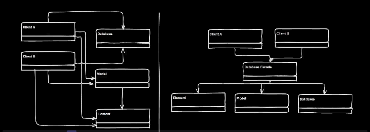
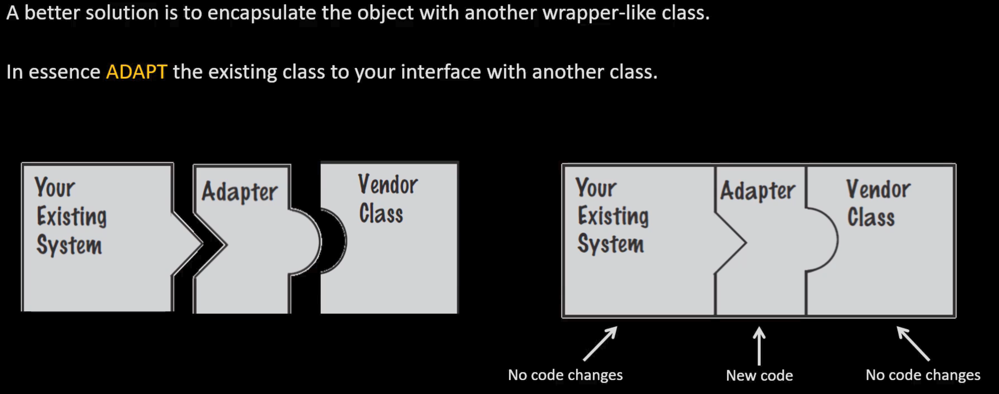

# Facade Pattern

## Definition
- Provide unified interface to set of interfaces in subsystem
- Facade defines higher-level interface that makes subsystem easier to use
- States we need simpler way to access complex system
- Hides complexity of one or more classes behind simple interface

## Key Features

### Intent
- Want to simplify how to use existing system
- Need to define your own interface

### Problem
- Need to use only subset of complex system

### Solution
- Create new interface for client to use

### Participants & Collaborators
- Simplified interface for client

### Consequences
- Simplifies use of required subsystem
- Reduces options

### Implementation
- Define new class (or classes) with required interface
- Uses existing system internally

## Example Benefits
- One person learns complex system
- Develops interface everyone else can access
- Insulates clients from subsystem
- Works with subset of overall subsystem
- Changes to client or database only require reworking facade, not all classes



# Adapter Pattern

## Gang of Four Definition
Convert interface of class into another interface client expects. Adapter lets classes work together that couldn't otherwise due to incompatible interfaces.

## Key Features

### Intent
- Match existing object beyond your control to particular interface

### Problem
- System has right data and behavior but wrong interface
- Typically used when making something derivative of abstract class

### Solution
- Provide wrapper with desired interface
- Encapsulate object with wrapper-like class
- ADAPT existing class to your interface with another class

### Participants & Collaborators
- Adapter's Target (class it derives from)
- Allows Client to use Adaptee as if it were type of Target

### Consequences
- Allows preexisting objects to fit into new class structures

### Implementation
- Contain existing class in another class
- Containing class matches required interface
- Calls methods of contained class

## UML Diagram
```
Client -----> Target
                ^
                |
                Adapter -----> Adaptee
            +request()     +specificRequest()

Adapter->SpecificRequest
```



# Adapter vs Facade Comparison

| Question | Facade | Adapter |
|:---------|:-------|:--------|
| Are there preexisting classes? | Yes | Yes |
| Is there an interface we MUST design to? | No | Yes |
| Does object need to behave polymorphically? | No | Probably |
| Is simpler interface needed? | Yes | No |

**Adapter**: When you need to use existing class and its interface is not the one you need  
**Facade**: When you need to simplify and unify large interface or complex set of interfaces

# Strategy Pattern

## Definition
Defines family of algorithms, encapsulates each one, makes them interchangeable. Strategy lets algorithm vary independently from clients that use it.

## Intent
- Enable use of different business rules or algorithms depending on context
- Design for change wisely

## Problem
- Algorithm selection depends on client making request or data being acted on
- How to handle different implementations of conceptually same task?

## Solution
- Separate algorithm selection from algorithm implementation
- Find what varies and encapsulate it in its own class
- Use aggregation to give object ability to handle functionality

## Implementation
- Context class contains abstract Strategy class
- Strategy has abstract method specifying how to call algorithm
- Each derived class implements needed algorithm

## Based on Principles
- Objects have responsibilities
- Different implementations manifested through polymorphism
- Need to manage several implementations of same basic algorithm

# Bridge Pattern

## Gang of Four Definition
Decouple an abstraction from its implementation so that the two can vary independently.

## Key Features

### Intent
- Separate class's interface from its implementation
- Allow both to vary independently without affecting each other

### Problem
- When abstraction and implementation should vary independently
- Proliferation of classes from trying to extend in multiple dimensions
- Need to avoid permanent binding between abstraction and implementation

### Solution
- Separate abstraction and implementation into different class hierarchies
- Use aggregation to connect abstraction to implementation
- Bridge uses encapsulation, aggregation, can use inheritance

### Participants & Collaborators
- **Abstraction**: Defines abstract interface, maintains reference to Implementor
- **RefinedAbstraction**: Extends interface defined by Abstraction
- **Implementor**: Defines interface for implementation classes
- **ConcreteImplementor**: Implements Implementor interface

### Consequences
- Decouples interface and implementation
- Improves extensibility - can extend abstraction and implementation hierarchies independently
- Hides implementation details from clients
- Reduces number of subclasses

### Implementation
- Create two separate hierarchies: one for abstractions, one for implementations
- Abstraction contains reference to implementation object
- Abstraction delegates work to implementation object
- Can switch implementations at runtime

## UML Diagram
```Haskell
Client -----> Abstraction -----> Implementor
                  ^                    ^
                  |                    |
         RefinedAbstraction    ConcreteImplementorA
                              ConcreteImplementorB
```

## Example Structure
```Haskell
Abstraction
- implementor: Implementor
+ operation()

RefinedAbstraction extends Abstraction
+ refinedOperation()

Implementor
+ operationImpl()

ConcreteImplementorA implements Implementor
+ operationImpl()

ConcreteImplementorB implements Implementor  
+ operationImpl()
```

## Common Problematic Approaches

### Copy/Paste
- Traditional method - maintenance headaches
- Copy working code, paste elsewhere, modify

### Switches/Ifs
- Coupling and testing issues
- Multiple variations create messy code
- "Switch creep" - must find every place case is involved
- Variations "dirty" the implementation
- Hard to read flow

### Function Pointers/Delegates
- Used in C++/C#
- Hides code in compact function
- Can't retain state per-object → limited use

### Inheritance Alone
- Allows reuse
- Problem: When things vary independently → too many classes!

## Strategy Pattern Advantage
- Pushes problem down the chain
- From: One large hierarchy with all variations
- To: Few smaller, independent hierarchies
- Other system pieces can use smaller hierarchies

## Two Common Change Approaches to Avoid
- **Over-analyze**: Analysis paralysis
- **Jump in**: Write code without long-term consideration

# Additional Design Principles
    
## Software Development Problems

### Poor Requirements
- Incomplete, wrong, misleading users
- Perfect requirements cannot be developed
- Requirements always change
- Code must accommodate changes

### Debugging Reality
- Fixing bug is quick
- Finding bug takes time

## Maintainability Factors
- **Cohesion**: How closely operations in routine are related (high = good)
- **Coupling**: Strength of connection between routines (low = good)

## Delegation
- Have sub-functions control themselves
- Reduces coupling between components
- Better than one main program controlling sub-programs

## Functional Decomposition
- Break complex problems into smaller parts
- Each part handles specific task
- Easier to deal with smaller problems

## Object-Oriented Best Practices
- Design to interfaces, not implementations
- Favor aggregation over inheritance
- Find what varies and encapsulate it
- Objects should be responsible for themselves